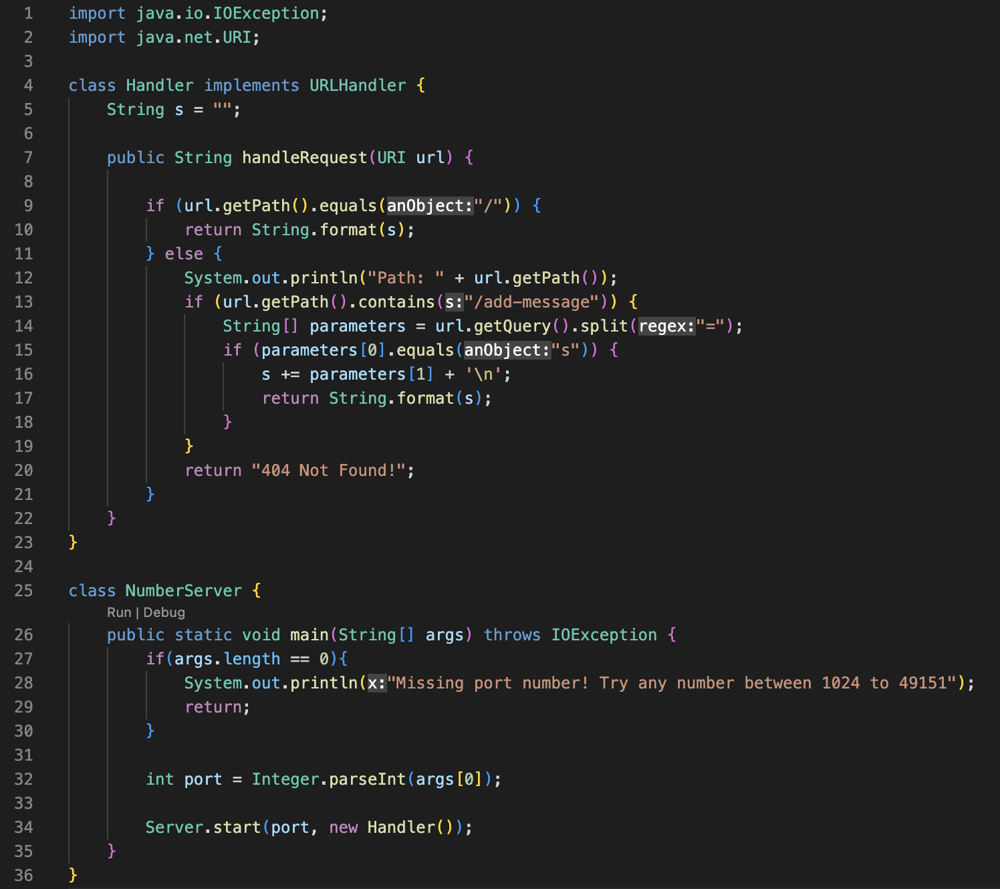
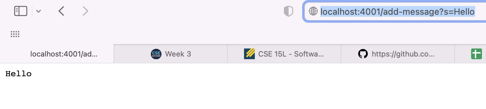
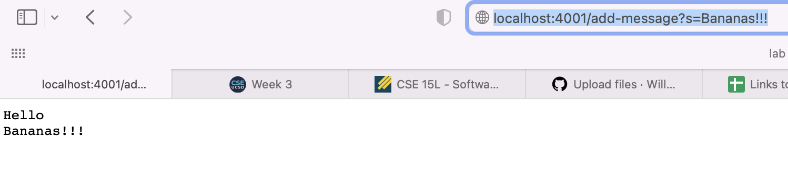
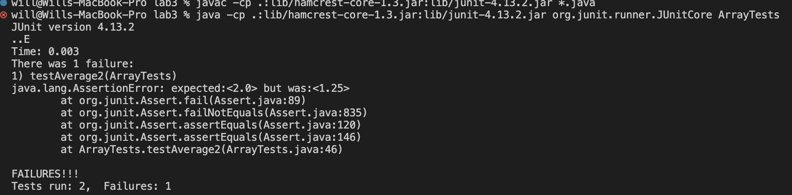

# Lab Report Two
1) Server 2) Bugs 3) Reflection

## Part 1: String Server
In this section I will be covering 

This is a screenshot of the code used to run the server. Areas of note are the two classes Handler and StringServer. StringServer is responsible for running the actual server while Handler is responsible for updating the server by adding new messages.

* In this screenshot the class being used is the Handler class with the method `handleRequest` being the method doing all of the work.
* The relevant aspect of the method for this specific call is the else statement, in which the code checks the path and if it contains `/add-message`. If it does, which this test does, the code then checks if `s` is included in the first part of the query. Then if it is, the text containing our message is concatenated with the new text with the addition of a new line character. 
* The values that change in this run is just the `String s` at the top of the Handler class. The string is concatenated with the value `"Hello" + '\n'`.

* This screenshot is simlar with the class used being Handler class with the method `handleRequest` being the method doing all of the work.
* For this the relevant aspects of the method for this specific call is similar to the last screenshot with the else statement being used, in which the code checks the path and if it contains `/add-message`. If it does, which this test does, the code then checks if `s` is included in the first part of the query. Then if it is, the text containing our message is concatenated with the new text with the addition of a new line character. 
* The values that change in this run is just the `String s` at the top of the Handler class. The string is concatenated with the value `"Banana!!" + '\n'`.
## Part 2: Bugs
 In this section I will be going over one of the bugs we covered in class. For this I will be choosing the `averageWithoutLowest` method in the `ArrayExamples` class.  This method is intended to take an array of doubles and return the average of the numbers, excluding the single lowest number. However the program instead returns the average of the numbers in the array, excluding all occurrences of the lowest number. For example the array of `[1.0, 1.0, 1.0, 1.0, 1.0, 5.0]` would return `5.0 / 5` instead of `9.0 / 5`. I fixed this program by changing the way in which it summed the numbers. I did this by summing up all the numbers in the array and then subtracting the lowest number at the end. This fixed the bug in the array and made it so it returned the correct average everytime.
 * A failure inducing input for this:
```
@Test
  public void testAverage2() {
    double[] input = {1.0, 1.0, 1.0, 1.0, 5.0};
    double output = 8.0/4;
    assertEquals((Double) output, (Double) ArrayExamples.averageWithoutLowest(input));
  }
```
* An input that does not induce failure is:
```
 @Test
  public void testAverage1() {
    double[] input = {1.0, 2.0, 3.0, 4.0, 5.0};
    double output = 14.0/4;
    assertEquals((Double) output, (Double) ArrayExamples.averageWithoutLowest(input));
  }
```
* Symptom:


* Before:
```
  static double averageWithoutLowest(double[] arr) {
    if(arr.length < 2) { return 0.0; }
    double lowest = arr[0];
    for(double num: arr) {
      if(num < lowest) { lowest = num; }
    }
    double sum = 0;
    for(double num: arr) {
      if(num != lowest) { sum += num; }
    }
    return sum / (arr.length - 1);
  }
```
* After:
```
  static double averageWithoutLowest(double[] arr) {
    if(arr.length < 2) { return 0.0; }
    double lowest = arr[0];
    for(double num: arr) {
      if(num < lowest) { lowest = num; }
    }
    double sum = 0;
    for(double num: arr) {
       sum += num; 
    }
    sum = sum - lowest;
    return sum / (arr.length - 1);
  }
```

## Part 3: Reflection
Over the past two weeks I learned how to create a server on my own computer and on a local wifi. The part I found the most exciting and really eye opening was the part in which I had people connect to the server running on the CSE computers that I remote started. I thought this was really interesting because it made me realize how LAN servers work for games I play. So lab 2 taught me about remote connecting and how LAN servers work.
