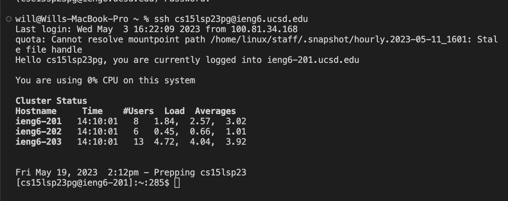
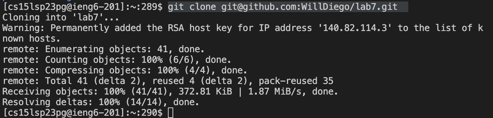
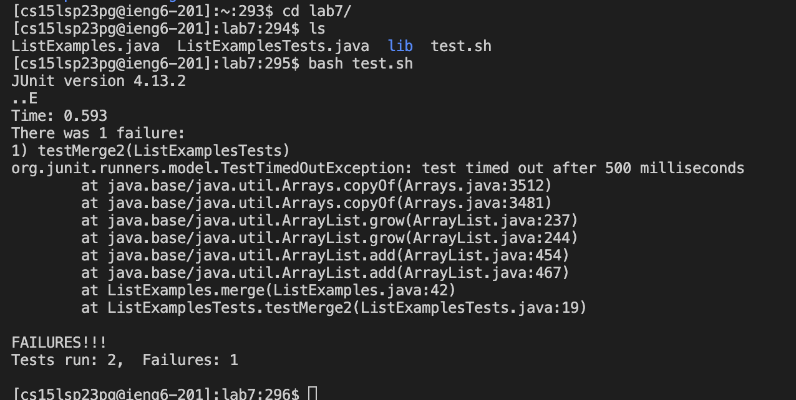
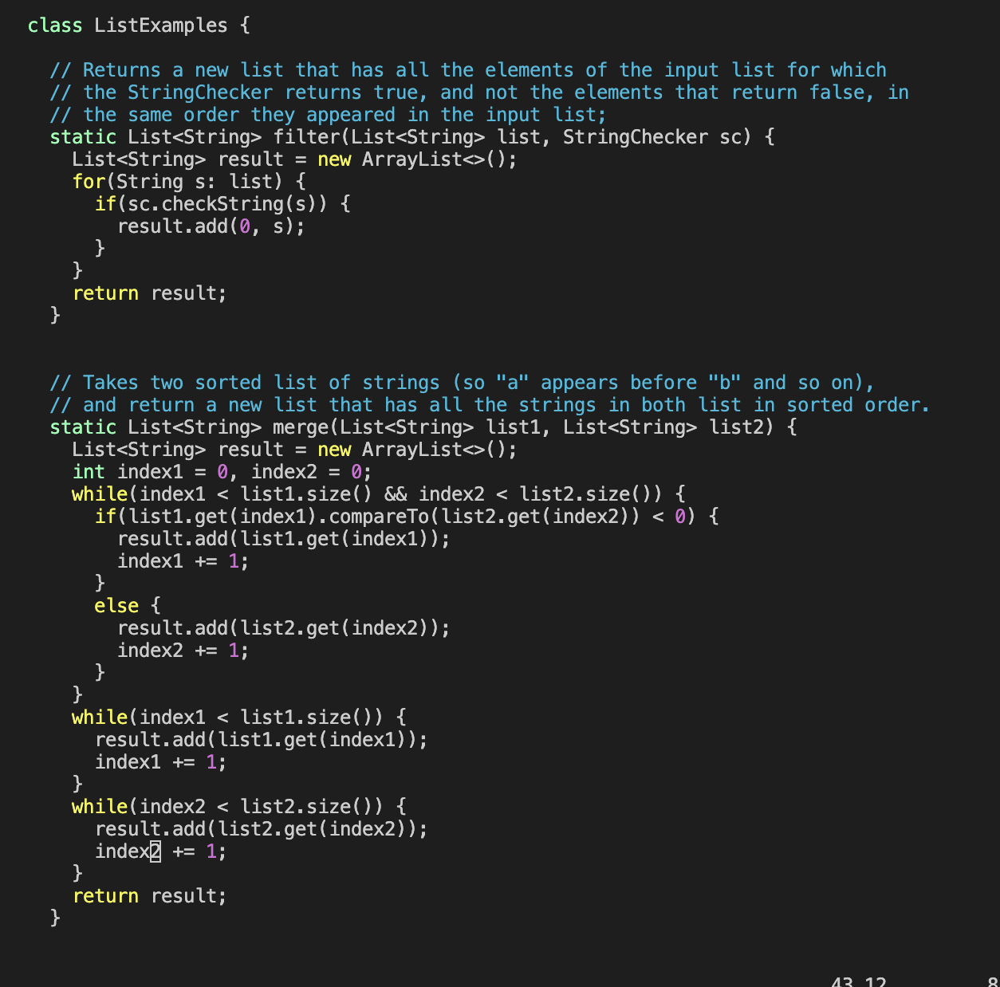
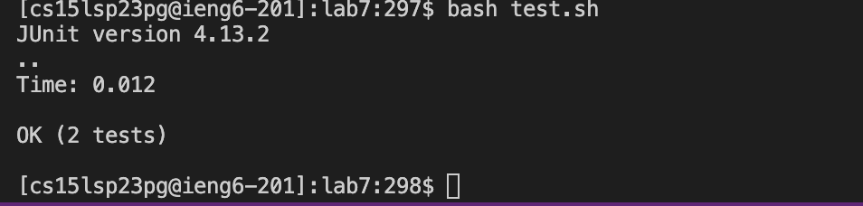
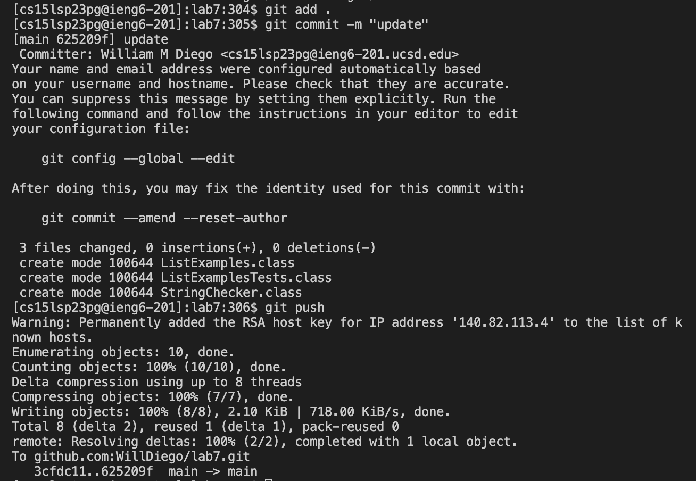

# Lab Report 4
In this lab report I will be covering using vim to edit a file, providing the exact key strokes I use.

## Step 1: Logging into ieng6:
To log in to the ieng6 remote server I typed: 
```
ssh cs15lsp23pg@ieng6.ucsd.edu <enter>
```
Since I have configured my account to not prompt for password I did not need to type in a password.


## Step 2: Clone My Fork
To clone the repository I typed:
```
git clone git@github.com:WillDiego/lab7.git <enter>
```


## Step 3: Demonstrate Failure
To demonstrate that the code is buggy I typed:
```
“cd lab7/” <enter> “ls” <enter> “bash test.sh” <enter>
```
So the first command was to change the directory into the lab7/ directory. Then I checked to see the contents, then I ran the bash file and was given the error below.


## Step 4: Edit Code
To edit the code I typed:
```
“vim ListExamples.java” <enter> “jjjjjlllxi2” <esc> “:wq”
```
What I did here was open the ListExamples file in vim then move the cursor down then to the right. Then pressed x to delete and then i to go to insert mode then 2 to add the number 2 then escape to leave insert mode then the last command to save and quit.


## Step 5: Demonstrate Success
  ```
<up> <up> <enter>
  ```
  
  
## Step 6: Commit and Push
I typed:
```
git add . <enter>
git commit -m "update" <enter>
git push <enter>
```



